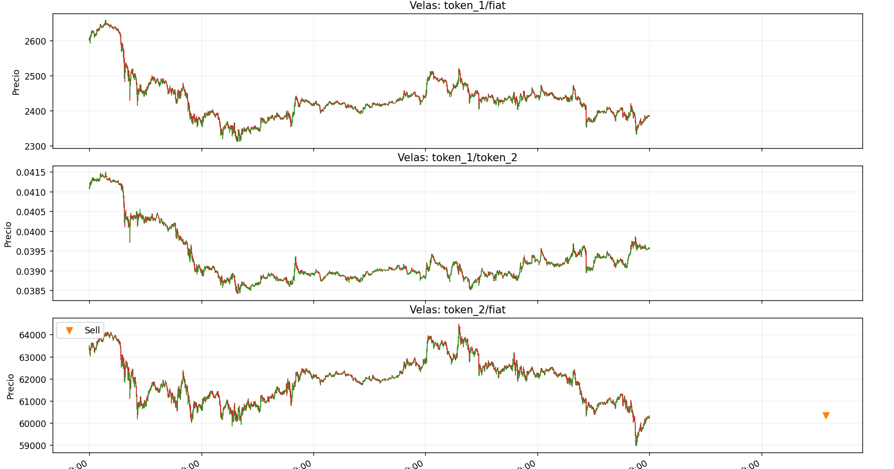

# Trading Framework — Hackathon 2026

Framework de trading algorítmico y backtesting de criptomonedas desarrollado para la **Hackathon 2026 de la ETSI Informática de la Universidad de Málaga**, en colaboración con la **Cátedra Fintech**.

La competición se aloja en [Kaggle](https://www.kaggle.com) y el objetivo es diseñar estrategias de trading que maximicen un *score* compuesto basado en rentabilidad ajustada al riesgo.

## Descripción general

Este framework permite a los equipos:

* Desarrollar estrategias de trading algorítmico para mercados de criptomonedas (ETH, BTC, USDT).
* Hacer backtesting sobre datos históricos de mercado a resolución de 1 minuto.
* Optimizar hiperparámetros automáticamente con [Optuna](https://optuna.org).
* Evaluar el rendimiento con métricas estándar (Sharpe, Max Drawdown, Turnover).
* Empaquetar y enviar la estrategia en formato estandarizado para su evaluación.

## Estructura del proyecto

```
exchange/
  trade.py          Motor de backtesting, optimización y CLI
  engine.py         Simulación de condiciones de mercado
strategy/
  main.py           Punto de entrada (expone on_data al motor)
  strategy.py       Wrapper que orquesta estrategia + coordinador + riesgo
  estrategia_unificada.py   Lógica de trading (4 módulos)
  coordinador.py    Filtro de posiciones (evita duplicados)
  gestion_riesgo.py Dimensionamiento de órdenes y límites de exposición
  best_params.json  Parámetros óptimos guardados tras optimización
scripts/
  download.py       Descarga de datos de mercado desde Binance
  merge.py          Fusión de CSVs multi-par en un solo fichero
data/
  test.csv          Datos de entrenamiento fusionados
  *_1m.csv          Datos por par a resolución de 1 minuto
```

## Funcionamiento del código

### Motor de backtesting y entrenamiento (`exchange/trade.py`)

`trade.py` es el núcleo del framework. Cumple dos funciones principales:

1. **Backtesting**: simula la ejecución de la estrategia tick a tick sobre datos históricos. Gestiona un `Trader` virtual con balances de fiat, token\_1 y token\_2, ejecuta las órdenes generadas por la estrategia, aplica comisiones y calcula métricas de rendimiento (Sharpe ratio, Max Drawdown, Turnover, PnL).

2. **Optimización con Optuna**: cuando se usa el flag `--optimize`, lanza múltiples *trials* que exploran distintas combinaciones de hiperparámetros de la estrategia. Cada trial ejecuta un backtest completo y evalúa el *score* de Kaggle:

$$\text{Score} = 0.7 \times \text{Sharpe} - 0.2 \times |\text{MaxDD}| - 0.1 \times \frac{\text{Turnover}}{10^6}$$

Los mejores parámetros se guardan automáticamente en `strategy/best_params.json`.

### Estrategia (`strategy/`)

La estrategia se estructura en un pipeline de tres etapas:

- **`strategy.py`** — Wrapper principal que carga `estrategia_unificada.py`, el `PositionCoordinator` y el `RiskManager`. En cada tick invoca `on_data()`, filtra señales y dimensiona órdenes.

- **`estrategia_unificada.py`** — Contiene la lógica de trading con **4 módulos independientes**:
  1. **Arbitraje Triangular**: detecta ineficiencias entre los tres pares (ETH/USDT, BTC/USDT, ETH/BTC) para operaciones market-neutral.
  2. **Lead-Lag Cross-Asset**: usa el ROC de BTC como señal anticipada para ETH, explotando la reversión a la media del spread log(ETH/BTC).
  3. **Mean-Reversion Intra-Asset**: z-score dinámico con bandas adaptativas a la volatilidad para entradas de alta convicción.
  4. **Momentum Direccional**: cruces de EMA + ROC + confirmación por volumen, con stops y takes dinámicos vía ATR.

- **`coordinador.py`** — Filtra señales para evitar abrir posiciones duplicadas (solo compra si no hay posición abierta, solo vende si la hay).

- **`gestion_riesgo.py`** — Dimensiona cada orden según el valor del portafolio, la calidad de la señal (*consensus score*) y los límites de exposición configurados.

Al arrancar, `strategy.py` intenta cargar los parámetros optimizados desde `best_params.json`. En modo entrenamiento (Optuna), los parámetros se inyectan directamente en cada trial.

### Datos

Los datos de mercado son velas OHLCV de 1 minuto descargadas de Binance para tres pares:
- **ETH/USDT** (`ethusdt_1m.csv`)
- **BTC/USDT** (`btcusdt_1m.csv`)
- **ETH/BTC** (`ethbtc_1m.csv`)

El script `merge.py` los fusiona en un único CSV (`test.csv`) con columnas normalizadas (`pair`, `timestamp`, `open`, `high`, `low`, `close`, `volume`).

## Configuración del entorno

Este proyecto usa [just](https://github.com/casey/just) como gestor de tareas.

1. Instalar `just`
2. Instalar dependencias Python: `just install`
3. Ver comandos disponibles: `just`

## Inicio rápido

```shell
# Instalar dependencias (Python 3.11+ recomendado)
just install

# Descargar datos de mercado (ETH/USDT, BTC/USDT, ETH/BTC)
just download

# Empaquetar la estrategia para envío
just tar

# Ejecutar backtest con la estrategia actual
just trade

# Optimizar hiperparámetros con Optuna (15 trials por defecto)
just optimize
```

## Resultados

### Optimización (15 trials — Optuna)

Condiciones iniciales: ETH=100, BTC=10, USDT=500 000 · Fee: 3 bps (0.03%)  
El equity inicial total valorado a precios de apertura es **1 394 991.90 USDT**.

| Trial | Score Optuna |
|------:|-------------:|
| 0 | 2.4454 |
| 1 | 2.3216 |
| 2 | 1.9139 |
| 3 | 1.6063 |
| **4** | **2.6393 ✓ mejor** |
| 5 | 1.9441 |
| 6 | 1.9150 |
| 7 | 1.7655 |
| 8 | 1.3539 |
| 9 | 2.1949 |
| 10 | 2.1867 |
| 11 | 1.7242 |
| 12 | 2.5646 |
| 13 | 2.6092 |
| 14 | 1.9540 |

El **trial 4** obtuvo el mejor score de optimización (**2.64**). Este score es interno y maximiza el Sharpe penalizado — no equivale al score final de Kaggle.

### Backtest final (con parámetros óptimos)

| Métrica | Valor |
|---|---|
| **Score Kaggle** | **0.5773** |
| PnL absoluto | +426 645.90 USDT |
| PnL porcentual | +30.58 % |
| Equity inicial | 1 394 991.90 USDT |
| Equity final | 1 821 637.80 USDT |
| Sharpe ratio | 0.963 |
| Max Drawdown | −45.48 % |
| Turnover | 58 574.73 |
| Número de trades | 4 |
| Fees pagados | 17.57 USDT |

**Comparativa vs Buy & Hold:** la estrategia generó **+30.58 %** frente al **+31.50 %** del HODL puro, con la ventaja de haber operado activamente y con control de riesgo. La diferencia de rendimiento bruto es marginal (−0.92 pp), mientras que el score penaliza el drawdown del −45.5 %, que es el principal factor limitante.

**Desglose del score:**

$$\text{Score} = 0.7 \times 0.963 - 0.2 \times 0.4548 - 0.1 \times \frac{58574}{10^6} = 0.6741 - 0.0910 - 0.0059 = 0.5773$$

### Parámetros óptimos guardados (`best_params.json`)

Los parámetros clave del trial ganador:

| Grupo | Parámetro | Valor |
|---|---|---|
| Estrategia | `w_fast` / `w_slow` | 9 / 34 |
| Estrategia | `w_regime` | 752 ticks (~12.5 h) |
| Estrategia | `candle_tf` | 67 ticks |
| Estrategia | `z_stat_arb` | 4.79 σ |
| Estrategia | `arb_edge_mul` | 3.44× fee |
| Coordinador | `buy_min_score` / `sell_min_score` | 0.323 / 0.739 |
| Riesgo | `max_exposure_pct` | 73.3 % |
| Riesgo | `max_trade_pct` | 0.91 % |

---



## Criterios de evaluación

Las estrategias se puntúan mediante la fórmula del *score* de Kaggle que combina Sharpe ratio (70%), Max Drawdown (20%) y Turnover (10%).

## Formato de envío

Los participantes deben enviar un archivo `.tar.gz` con el directorio `strategy/`, incluyendo el punto de entrada y toda la lógica personalizada.

Para generar el archivo de envío: `just tar`

